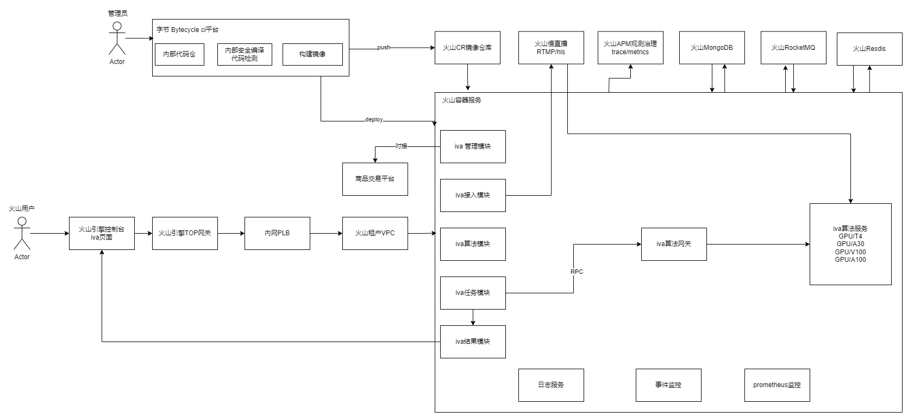

# Overview

**智能视频分析**，是基于深度学习视频结构化图像处理技术对视频图像进行处理分析的综合性平台，其核心是对视频结构化分析技术的应用。

**视频结构化分析技术**，是通过利用深度学习图像处理算法，包括对象解析、特征对比、关联聚类等图像处理与分析方法，从视频流、视频片段、图片中识别并提取人员、车辆、物品、事件、场所等对象的图片、特征属性、特征向量等信息，包括人脸解析、人体解析、人员行为解析、机动车解析、非机动车解析等。通过对超大规模目标特征向量距离计算和分析，实现相同或相似目标集合归类的视频图像分析技术，包括人员聚类、车辆聚类等。

**通用视频分析平台**是“智能视频分析”的公有云子产品，其具体功能包括用户管理、视频接入、AI智能分析、任务管理、结果查看及违规事件上报、数据总览、数据管理等几大功能模块。

算法仓库中的算法模型清单，包含人、车、物体、事件多种场景算法，且持续扩展中。基于智能视频分析中台对AI算法的共享及复用，支持对参与使用AI智慧平台的相关角色进行管理，算法配置的标准化，能够对地域内各应用单位的个性化视频分析需求提供迅速构建能力的支持，为各业务场景数字化智慧化运营提供赋能。

# 共有云架构

用户体验：

1. 实名用户登录平台
2. 购买套餐，管理模块对接商品交易平台，更新用户资源。
3. 创建数据集，接入模块，对接视频、图片等
4. 用户创建任务：任务模块对接算法网关。算法网关对接算法
5. 落库，结果返回给用户

后端流程：

- 服务上线：代码提交 -> *Bytecycle*流水线 -> 推送镜像 -> 服务部署
- 算法上线：推送镜像 -> *CRD*部署
- 同步任务：任务模块 -> rpc请求 -> 算法网关 -> rpc请求 -> 算法服务
- 异步任务：：任务模块 -> rpc请求(带*rocketmq Topic Group*信息) -> 算法网关 -> *rpc*请求 -> 算法服务 -> *RocketMQ* -> 任务模块
- 算法限流：*Redis+lua*、*kitex* 客户端限流
- 数据库：MongDB
- APM: metris和trace。

# 私有化架构

  ## veStack架构

