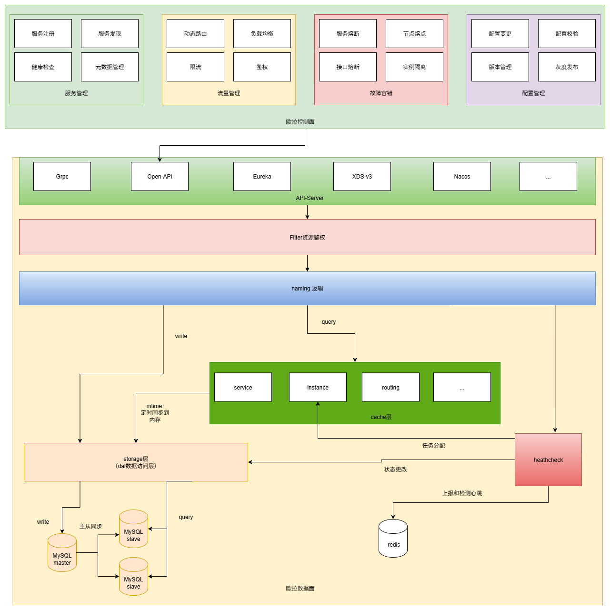

# Overview

祝OPPO和小伙伴们越来越好

欧拉名字服务，是OPPO的服务治理平台（基于腾讯开源的北极星改造而来），致力于解决分布式和微服务架构中的服务管理、流量管理、配置管理、故障容错和可观测性问题，针对不同的技术栈和环境提供服务治理的标准方案和最佳实践。

# 架构图

# 服务注册流程

服务数据主要包括以下部分：

- 服务名：服务的唯一标识，区分大小写。
- 服务元数据：服务的标签信息，KV格式，可对服务进行分类，可用于过滤。
- 服务实例：提供服务的节点列表，以IP:PORT的方式提供。
- 服务实例元数据：服务实例的标签信息，KV格式，通常用于描述节点的集群、版本等，用于后续流量治理等操作。

# 服务发现

北极星提供了多语言SDK，SDK通过ConsumerAPI提供3个接口进行服务发现：

- getAllInstances：获取服务下全量的服务实例列表，不做任何过滤。
- getHealthyInstances：获取服务下健康的服务实例列表，只包含健康实例，不包含被熔断、不健康、隔离、权重为0的实例。
- getOneInstances：针对健康的服务实例列表，进行动态路由和负载均衡，返回单个可用的服务实例。

# 健康检查

健康检查提供了一种机制，使得控制面可以在一定时间段内，感知服务实例出现异常，从而将异常节点剔除，并通知给所有的消费者。

# 配置管理

