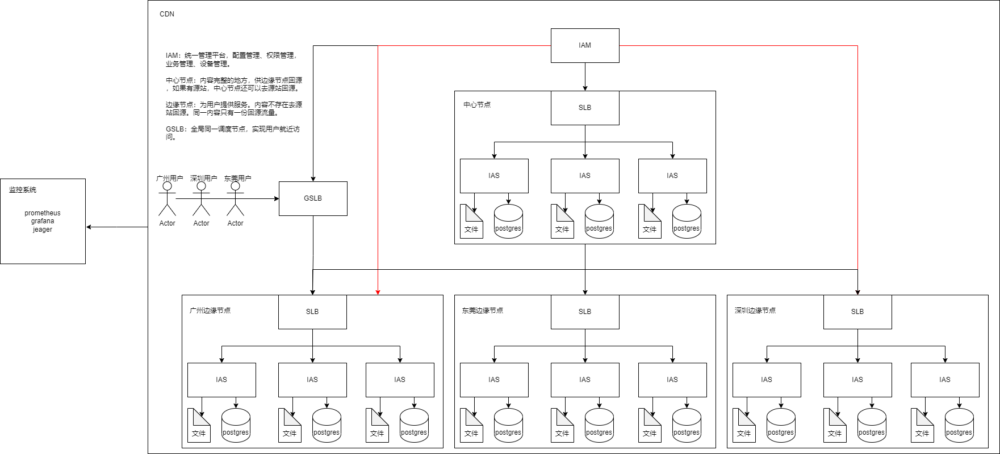

# Overview

根据之前在ZTE的OTT团队所来的经验。祝ZTE和小伙伴们越来越好

OTT解释：互联网电视即OTT（Over the Top），是指以广域网即传统互联网或移动互联网为传输网络，以电视机为接收终端，向用户提供视频及图文信息内容等服务的电视形态。它有别于交互式网络电视（IPTV），不受地域限制，只要有能够接入互联网端口的电视机、电脑、平板电脑、手机等视频接收终端，就可以收看电视节目。

*ZTE-CDN*是中兴通讯独立自研的一套网络分发流媒体服务系统，主要服务用于中国移动、联通、电信三大运营商的互联网电视。*OTT*(*OverTheTop*)作为流媒体服务节点，主要提供*LIVE、VOD、TVOD、TSTV*服务, 支持的流媒体主要协议有*HLS、DASH、RTMP、AVS、AVS+(AVS2.0)*

# 架构图

- SLB本质上是一个nginx，通过一定的调度算法。将用户的请求，代理到指定的IAS设置。
- IAS 主要只有两个功能，一个是给用户提供服务（nginx），另一个是业务处理（Tomcat）

> nginx+lua的高性能架构，能快速处理用户请求
>
> Tomcat运行java显得有点笨重，建议使用golang替代
>
> 传统架构服务部署有点笨重，建议使用容器
