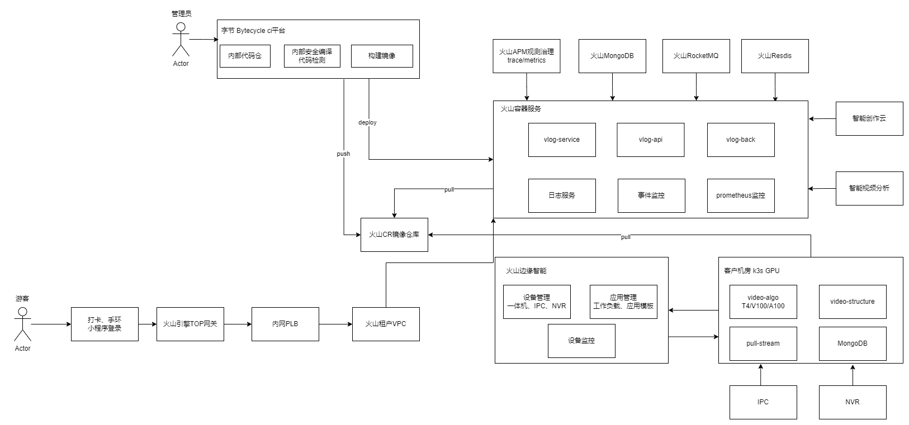

# Overview

*Vlog*可以*AI*成片创意你的影像人生，在观光游览、体验玩乐、竞技运动的场景，通过用户手机或摄像设备采集被拍摄者的多段视频，通过智能创作云将多条视频融合处理，并套用预制的视频素材模板，生成记录被拍摄者的短视频的软硬件一体化解决方案。为景区&乐园&体验场馆&商圈&博物馆，提供解决无法自主拍摄的场景、身临其境的沉浸式体验场景拍摄痛点，降低用户视频的制作门槛。成片能快速分享抖音。

# *vlog*架构

流程说明：

游客注册人脸 -> 智能视频分析获取人脸id -> 通过人脸提取每个摄像头的录制画面 -> 模板成片 -> RocketMQ ->火山容器服务 -> 智能创作云处理 -> 通知用户成片 -> 分享抖音
