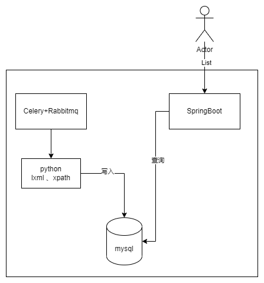

# Overview

根据之前在华为所来的经验，祝华为和小伙伴们越来越好

*VODC*是华为内源社区中一个重要的网元，其主要作用是负责采集开源软件的信息，包括软件*License*、官网地址、软件依赖的组件、组件依赖的组件，包括对应的漏洞信息，影响版本、解决版本等。达到小时级感知。作为神经网元为下游网元提供服务，给用户提供可靠的软件信息和漏洞解决方案。

# 架构图

- *Celery* 定时将软件信息写入*RabbitMQ*
- *Python*服务获取到信息，定期去官网、*github*、*pip*源上判断软件是否有更新
- 将软件信息写入数据库
- *SpringBoot*提供*http*服务

> 部署费劲、容器大法好。
